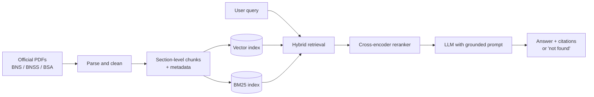

# NyayaLens: Citation-Grounded Assistant for India's New Criminal Codes

A domain-specific LLM system that answers questions about the **Bharatiya Nyaya Sanhita (BNS)**, **Bharatiya Nagarik Suraksha Sanhita (BNSS)** and **Bharatiya Sakshya Adhiniyam (BSA)**, and maps old **IPC / CrPC / Evidence Act** sections to their new equivalents, with every answer tied to a cited section.

> ⚠️ **Disclaimer:** This is a research and educational project. It provides legal *information*, not legal advice. Always verify against the official text and consult a qualified lawyer.

---

## Why this project?

India replaced the IPC, CrPC and Indian Evidence Act with the BNS, BNSS and BSA. General-purpose LLMs were trained mostly on the old codes, so they often:

- quote outdated IPC section numbers as if they were current,
- confuse old and new numbering (e.g. IPC 420 vs. its BNS counterpart),
- hallucinate punishments or section text.

This project measures that failure and fixes it with retrieval-augmented generation (RAG) over the official texts, with answers that must cite their source or say "not found".

## Example queries

| Query | Expected behaviour |
|---|---|
| "What is the BNS section corresponding to IPC 420, and what changed?" | Section mapping plus a summary of differences, with citations |
| "What is the punishment for snatching under the BNS?" | Section text summary with the section number cited |
| "Which BNSS section covers zero FIR?" | Correct BNSS section with a grounded explanation |
| "What is the capital of France?" | Politely declines as out of scope |

## Features

- **Section-aware retrieval:** one chunk per section, with metadata (act, chapter, section number)
- **Hybrid search:** BM25 plus dense embeddings, followed by cross-encoder reranking
- **IPC ↔ BNS ↔ CrPC ↔ BNSS mapping** using the official comparison tables
- **Grounded generation:** answers cite sections, with a "not found" fallback
- **Evaluation harness:** hand-built test set, citation accuracy, retrieval recall@k, faithfulness
- **Baseline comparison:** general LLM without RAG vs. this system
- *(Planned)* Hindi and Bengali query support
- *(Optional)* QLoRA fine-tuning for answer format, or a fine-tuned embedding model

## Architecture



## Tech stack

| Layer | Tools |
|---|---|
| Parsing | PyMuPDF / pdfplumber |
| Embeddings | Sentence-Transformers (e.g. BGE / E5 family) |
| Vector store | FAISS or Chroma |
| Keyword search | rank-bm25 |
| Reranker | Cross-encoder from Sentence-Transformers |
| LLM | Open-weights model or API (configurable) |
| Fine-tuning (optional) | Hugging Face PEFT + TRL (QLoRA) |
| Evaluation | RAGAS + custom metrics |
| UI | Streamlit or Gradio |
| Tracking | Weights & Biases or MLflow |

## Repository structure

```
nyayalens/
├── data/
│   ├── raw/              # Downloaded bare-act PDFs (not committed)
│   ├── processed/        # Parsed sections (JSONL)
│   └── mapping/          # IPC-BNS, CrPC-BNSS, Evidence-BSA tables
├── src/
│   ├── ingest/           # PDF parsing and section chunking
│   ├── retrieval/        # BM25, dense, hybrid, reranker
│   ├── generation/       # Prompts and answer pipeline
│   ├── finetune/         # (optional) QLoRA / embedding fine-tuning
│   └── app/              # Streamlit / Gradio UI
├── eval/
│   ├── testset.jsonl     # Expert-checked questions and answers
│   ├── run_baseline.py   # General LLM, no RAG
│   └── run_eval.py       # Full pipeline evaluation
├── notebooks/
├── requirements.txt
└── README.md
================
├── src/
│   ├── ingest/           # PDF parsing and section chunking
│   ├── retrieval/        # BM25, dense, hybrid, reranker
│   ├── generation/       # Prompts and answer pipeline
│   ├── finetune/         # (optional) QLoRA / embedding fine-tuning
│   └── app/              # Streamlit / Gradio UI
├── eval/
│   ├── testset.jsonl     # Expert-checked questions and answers
│   ├── run_baseline.py   # General LLM, no RAG
│   └── run_eval.py       # Full pipeline evaluation
```

## Getting started

### 1. Clone and install

```bash
git clone https://github.com/<your-username>/nyayalens.git
cd nyayalens
python -m venv .venv && source .venv/bin/activate
pip install -r requirements.txt
```

### 2. Add the data

Download the official texts of the BNS, BNSS and BSA (for example from India Code or the Ministry of Home Affairs website) and place the PDFs in `data/raw/`. Add the official comparison tables to `data/mapping/`.

> Check the licence and terms of use of each source before redistributing any data.

### 3. Build the index

```bash
python -m src.ingest.build_index
```

### 4. Run the app

```bash
streamlit run src/app/main.py
```

### 5. Run the evaluation

```bash
python eval/run_baseline.py   # general LLM, no retrieval
python eval/run_eval.py       # full RAG pipeline
```
##DEMO


## Evaluation

The test set is written and reviewed by hand, with a train/validation/test split made before any synthetic data generation to avoid leakage.

| Metric | Baseline LLM (no RAG) | This system |
|---|---|---|
| Citation accuracy (correct section number) | _TBD_ | _TBD_ |
| Old-to-new section mapping accuracy | _TBD_ | _TBD_ |
| Retrieval recall@5 | n/a | _TBD_ |
| Faithfulness (RAGAS) | _TBD_ | _TBD_ |
| Correct refusal on out-of-scope queries | _TBD_ | _TBD_ |

_Results will be filled in as experiments are completed._

## Roadmap

- [ ] Parse and chunk BNS, BNSS, BSA by section
- [ ] Build IPC/CrPC/Evidence ↔ new-code mapping table
- [ ] Create the 100+ question evaluation set
- [ ] Baseline evaluation of a general LLM
- [ ] Hybrid retrieval and reranking
- [ ] Grounded generation with citations and "not found" fallback
- [ ] RAGAS and citation-accuracy evaluation
- [ ] Streamlit / Gradio demo
- [ ] Hindi and Bengali query support
- [ ] (Optional) QLoRA fine-tuning and embedding fine-tuning
- [ ] Add adversarial tests (prompt injection, out-of-scope, outdated-law questions)

## Limitations

- Covers only the BNS, BNSS and BSA (plus mapping tables), not case law, rules or state amendments.
- Laws can be amended; the index reflects only the texts you ingest.
- Retrieval and generation can still be wrong. Do not rely on outputs for legal decisions.
- Multilingual support is experimental.

## Contributing

Issues and pull requests are welcome, especially for test-set questions, parsing fixes, and mapping-table corrections.

## Licence

Code is released under the MIT Licence (see `LICENSE`). Legal texts remain subject to their original terms of use.

## Author

**Sankha Suvra Ghosh**
B.Tech CSE (AI & ML), Future Institute of Technology, Kolkata

- GitHub: `<https://github.com/sankhasuvraghosh>`


## Acknowledgements

- Government of India for publishing the official texts
- Hugging Face, Sentence-Transformers, FAISS, and RAGAS communities
