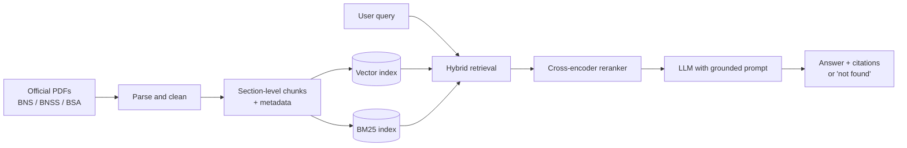

# Themis: Citation-Grounded Assistant for India's New Criminal Codes

A domain-specific LLM system that answers questions about the **Bharatiya Nyaya Sanhita (BNS)**, **Bharatiya Nagarik Suraksha Sanhita (BNSS)** and **Bharatiya Sakshya Adhiniyam (BSA)**, and maps old **IPC / CrPC / Evidence Act** sections to their new equivalents, with every answer tied to a cited section.

> ⚠️ **Disclaimer:** This is a research and educational project. It provides legal *information*, not legal advice. Always verify against the official text and consult a qualified lawyer.

---

## Why this project?

India replaced the IPC, CrPC and Indian Evidence Act with the BNS, BNSS and BSA. General-purpose LLMs were trained mostly on the old codes, so they often:

- quote outdated IPC section numbers as if they were current,
- confuse old and new numbering (e.g. IPC 420 vs. its BNS counterpart),
- hallucinate punishments or section text.

This project measures that failure and fixes it with retrieval-augmented generation (RAG) over the official texts, with answers that must cite their source or say "not found".

## Example queries

| Query | Expected behaviour |
|---|---|
| "What is the BNS section corresponding to IPC 420, and what changed?" | Section mapping plus a summary of differences, with citations |
| "What is the punishment for snatching under the BNS?" | Section text summary with the section number cited |
| "Which BNSS section covers zero FIR?" | Correct BNSS section with a grounded explanation |
| "What is the capital of France?" | Politely declines as out of scope |

## Features

- **Section-aware retrieval:** one chunk per section, with metadata (act, chapter, section number)
- **Hybrid search:** BM25 plus dense embeddings, followed by cross-encoder reranking
- **IPC ↔ BNS ↔ CrPC ↔ BNSS mapping** using the official comparison tables
- **Grounded generation:** answers cite sections, with a "not found" fallback
- **Evaluation harness:** hand-built test set, citation accuracy, retrieval recall@k, faithfulness
- **Baseline comparison:** general LLM without RAG vs. this system
- *(Planned)* Hindi and Bengali query support
- *(Optional)* QLoRA fine-tuning for answer format, or a fine-tuned embedding model

## Architecture



## Tech stack

| Layer | Tools |
|---|---|
| Parsing | PyMuPDF / pdfplumber |
| Embeddings | Sentence-Transformers (e.g. BGE / E5 family) |
<<<<<<< HEAD
| Vector search | NumPy cosine similarity (FAISS optional at larger scale) |
| Keyword search | rank-bm25 |
| Reranker | Cross-encoder from Sentence-Transformers |
| LLM | Free Hugging Face model: Qwen2.5-1.5B-Instruct locally (default) or the HF Inference API |
| Fine-tuning (optional) | Hugging Face PEFT + TRL (QLoRA) |
| Evaluation | Custom metrics (citation accuracy, recall@k, refusal); RAGAS optional |
| UI | Streamlit |
| Tracking | JSON result files (W&B / MLflow optional) |
=======
| Vector store | FAISS or Chroma |
| Keyword search | rank-bm25 |
| Reranker | Cross-encoder from Sentence-Transformers |
| LLM | Open-weights model or API (configurable) |
| Fine-tuning (optional) | Hugging Face PEFT + TRL (QLoRA) |
| Evaluation | RAGAS + custom metrics |
| UI | Streamlit or Gradio |
| Tracking | Weights & Biases or MLflow |
>>>>>>> d1dc44677b5a41a6feb08d884c9d21ade96aa4b8

## Repository structure

```
themis/
├── data/
<<<<<<< HEAD
│   ├── raw/                  # bns.pdf, bnss.pdf, bsa.pdf (not committed)
│   ├── processed/            # sections.jsonl, SFT data (generated)
│   ├── index/                # chunks + embeddings (generated)
│   └── mapping/mapping.csv   # IPC/CrPC/IEA -> BNS/BNSS/BSA table (you fill this in)
├── src/
│   ├── config.py             # paths, model names, top-k settings
│   ├── ingest/               # parse_pdf.py, chunking.py, mapping.py, build_index.py
│   ├── retrieval/            # index.py (BM25 + dense + RRF), reranker.py
│   ├── generation/           # prompts.py, llm.py, pipeline.py
│   ├── finetune/             # make_sft_data.py, sft_qlora.py (optional)
│   └── app/main.py           # Streamlit UI
├── eval/
│   ├── testset.jsonl         # expert-checked questions (extend to 100+)
│   ├── metrics.py            # citation accuracy, recall@k, refusal
│   ├── run_baseline.py       # same LLM, no RAG
│   └── run_eval.py           # full pipeline
=======
│   ├── raw/              # Downloaded bare-act PDFs (not committed)
│   ├── processed/        # Parsed sections (JSONL)
│   └── mapping/          # IPC-BNS, CrPC-BNSS, Evidence-BSA tables
├── src/
│   ├── ingest/           # PDF parsing and section chunking
│   ├── retrieval/        # BM25, dense, hybrid, reranker
│   ├── generation/       # Prompts and answer pipeline
│   ├── finetune/         # (optional) QLoRA / embedding fine-tuning
│   └── app/              # Streamlit / Gradio UI
├── eval/
│   ├── testset.jsonl     # Expert-checked questions and answers
│   ├── run_baseline.py   # General LLM, no RAG
│   └── run_eval.py       # Full pipeline evaluation
├── notebooks/
>>>>>>> d1dc44677b5a41a6feb08d884c9d21ade96aa4b8
├── requirements.txt
└── README.md
```

## Getting started

### 1. Clone and install

```bash
git clone https://github.com/<your-username>/themis.git
cd themis
python -m venv .venv && source .venv/bin/activate
pip install -r requirements.txt
```

### 2. Add the data

<<<<<<< HEAD
Download the official texts of the BNS, BNSS and BSA (for example from India Code or the Ministry of Home Affairs website) and save them as `data/raw/bns.pdf`, `data/raw/bnss.pdf` and `data/raw/bsa.pdf`.

Then fill `data/mapping/mapping.csv` from the official comparison tables, using this header:

```csv
old_act,old_section,new_act,new_section,change_summary
```

`old_act` is one of `IPC`, `CrPC`, `IEA`; `new_act` is one of `BNS`, `BNSS`, `BSA`. Spot-check the rows by hand.
=======
Download the official texts of the BNS, BNSS and BSA (for example from India Code or the Ministry of Home Affairs website) and place the PDFs in `data/raw/`. Add the official comparison tables to `data/mapping/`.
>>>>>>> d1dc44677b5a41a6feb08d884c9d21ade96aa4b8

> Check the licence and terms of use of each source before redistributing any data.

### 3. Build the index

```bash
python -m src.ingest.build_index
```

<<<<<<< HEAD
The parser is heuristic and prints the section count per act (BNS 358, BNSS 531, BSA 170 are expected). **Open `data/processed/sections.jsonl` and spot-check a few sections** before trusting the results.

### 4. Choose a free Hugging Face LLM

Two backends are supported, selected with environment variables:

| Backend | Setup | Default model |
|---|---|---|
| `local` (default) | No token needed. Runs on CPU (slow) or a free Colab/Kaggle GPU. | `Qwen/Qwen2.5-1.5B-Instruct` |
| `api` | `export HF_TOKEN=...` (free Hugging Face token). Rate-limited free tier. | `Qwen/Qwen2.5-7B-Instruct` |

```bash
export THEMIS_LLM_BACKEND=local                  # or: api
export THEMIS_LLM_MODEL=Qwen/Qwen2.5-1.5B-Instruct   # any instruct model on the Hub
```

Free-tier availability on the Inference API changes over time, so check that your chosen model is currently served.

### 5. Run the app
=======
### 4. Run the app
>>>>>>> d1dc44677b5a41a6feb08d884c9d21ade96aa4b8

```bash
streamlit run src/app/main.py
```

<<<<<<< HEAD
### 6. Run the evaluation

```bash
python eval/run_baseline.py   # same LLM, no retrieval
python eval/run_eval.py       # full Themis pipeline
```

Results are saved to `eval/results/`. Extend `eval/testset.jsonl` to 100+ questions and verify each gold section against the official text.

### 7. (Optional) Fine-tune with QLoRA

Needs an NVIDIA GPU (a free Colab T4 works) and the optional packages listed in `requirements.txt`.

```bash
python -m src.finetune.make_sft_data
python -m src.finetune.sft_qlora
THEMIS_ADAPTER=models/themis-lora python eval/run_eval.py
```

The SFT data teaches answer *format* (citations and `NOT_FOUND`); facts still come from retrieval.

=======
### 5. Run the evaluation

```bash
python eval/run_baseline.py   # general LLM, no retrieval
python eval/run_eval.py       # full RAG pipeline
```

>>>>>>> d1dc44677b5a41a6feb08d884c9d21ade96aa4b8
## Evaluation

The test set is written and reviewed by hand, with a train/validation/test split made before any synthetic data generation to avoid leakage.

| Metric | Baseline LLM (no RAG) | This system |
|---|---|---|
| Citation accuracy (correct section number) | _TBD_ | _TBD_ |
| Old-to-new section mapping accuracy | _TBD_ | _TBD_ |
| Retrieval recall@5 | n/a | _TBD_ |
<<<<<<< HEAD
| Answers cite only retrieved sections | n/a | _TBD_ |
=======
| Faithfulness (RAGAS) | _TBD_ | _TBD_ |
>>>>>>> d1dc44677b5a41a6feb08d884c9d21ade96aa4b8
| Correct refusal on out-of-scope queries | _TBD_ | _TBD_ |

_Results will be filled in as experiments are completed._

## Roadmap

- [ ] Parse and chunk BNS, BNSS, BSA by section
- [ ] Build IPC/CrPC/Evidence ↔ new-code mapping table
- [ ] Create the 100+ question evaluation set
- [ ] Baseline evaluation of a general LLM
- [ ] Hybrid retrieval and reranking
- [ ] Grounded generation with citations and "not found" fallback
- [ ] RAGAS and citation-accuracy evaluation
- [ ] Streamlit / Gradio demo
- [ ] Hindi and Bengali query support
- [ ] (Optional) QLoRA fine-tuning and embedding fine-tuning
- [ ] Add adversarial tests (prompt injection, out-of-scope, outdated-law questions)

## Limitations

- Covers only the BNS, BNSS and BSA (plus mapping tables), not case law, rules or state amendments.
- Laws can be amended; the index reflects only the texts you ingest.
- Retrieval and generation can still be wrong. Do not rely on outputs for legal decisions.
- Multilingual support is experimental.

## Contributing

Issues and pull requests are welcome, especially for test-set questions, parsing fixes, and mapping-table corrections.

## Licence

<<<<<<< HEAD
Code is released under the MIT Licence (see `LICENSE`). Legal texts remain subject to their original terms of use.
=======
Code is released under the MIT Licence (see `(https://github.com/sankhasuvraghosh/themis-/blob/main/LICENSE)`). Legal texts remain subject to their original terms of use.
>>>>>>> d1dc44677b5a41a6feb08d884c9d21ade96aa4b8

## Author

**Sankha Suvra Ghosh**
B.Tech CSE (AI & ML), Future Institute of Technology, Kolkata

<<<<<<< HEAD
- GitHub: `<your-username>`
- LinkedIn: `<your-profile>`
=======
- GitHub: `<(https://github.com/sankhasuvraghosh)>`
>>>>>>> d1dc44677b5a41a6feb08d884c9d21ade96aa4b8

## Acknowledgements

- Government of India for publishing the official texts
<<<<<<< HEAD
- Hugging Face, Sentence-Transformers, FAISS, and RAGAS communities
=======
- Hugging Face, Sentence-Transformers, FAISS, and RAG communities
>>>>>>> d1dc44677b5a41a6feb08d884c9d21ade96aa4b8
